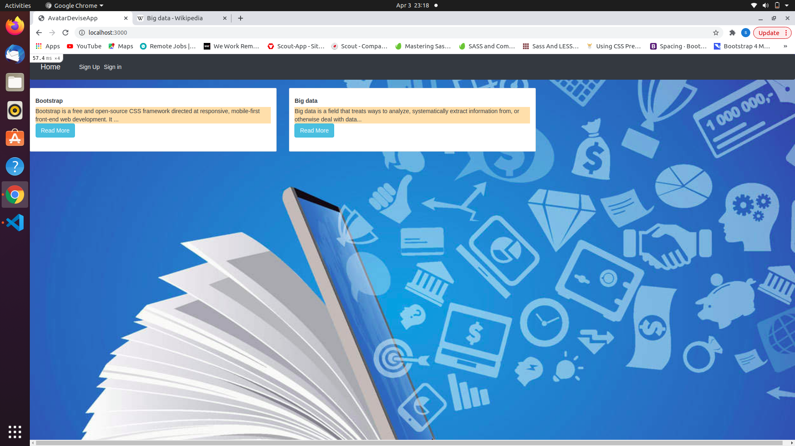
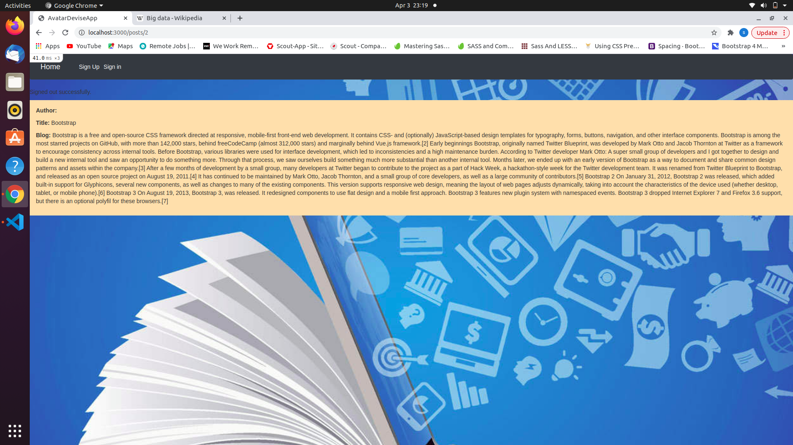
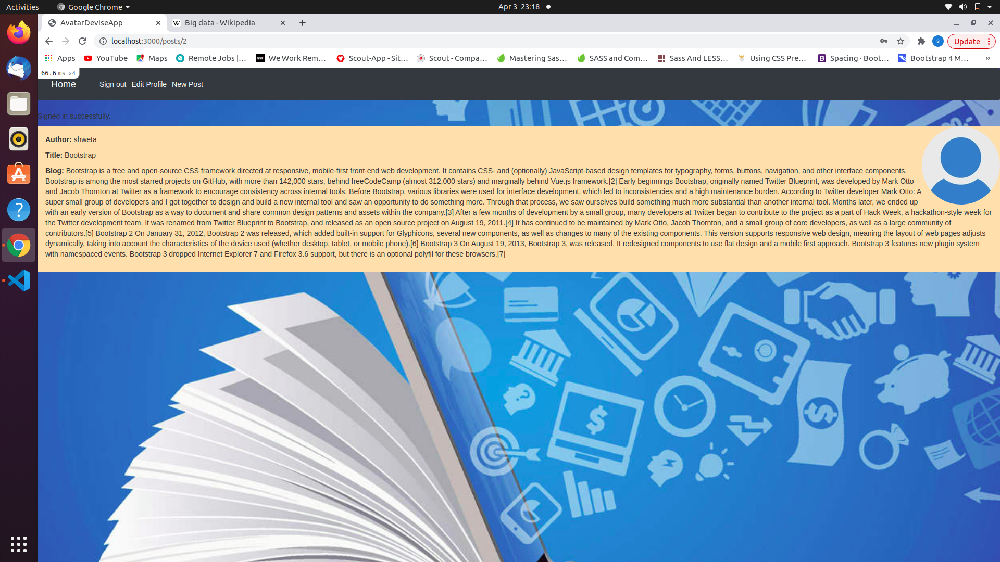
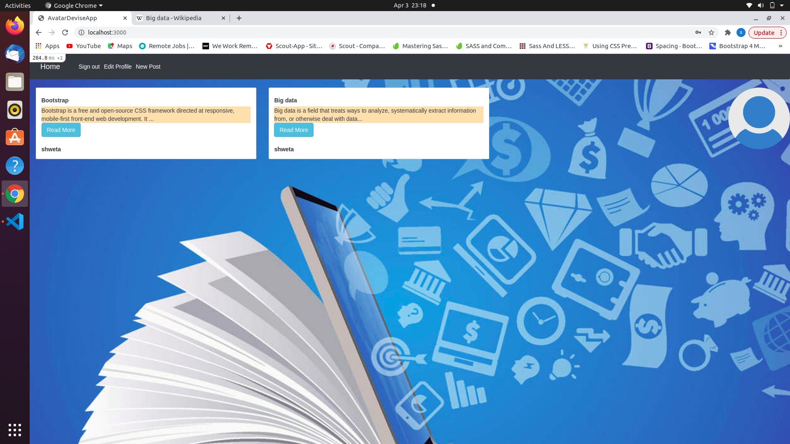

# README

# avatar_devise_app

> This project is about authentications of user signed in,and the part they access on post i.e. they can access author name when they are signed in, if not register they can only see posts but not the authors name, project is built with Rails.
  here I have used active storage for the avatar attached to the user, and devise is used for authentications.

Full project description - [Click here](https://www.theodinproject.com/courses/ruby-on-rails/lessons/authentication)

## Built With
- [RubyOnRails](https://rubyonrails.org/)

### Instructions

- Download or clone this repo.
https://https://github.com/vidhishweta01/Avatar_devise_app
- From your terminal, `cd` into the repo directory

Enter the proper branch by-
 git checkout devise

 -Run bin/yarn install, in order to prevent Webpacker::Manifest::MissingEntryError in Devise::Sessions#new error

-run `bundle install`.
- 
Run the command `rails db:create`. This will initialize the necessary migration files.
-
 Run the command `rails db:migrate`.

### Usage

- Run the command `rails s`.
- Open http://localhost:3000/ and create a user. 
- You can then edit that user.

## Authors

👤 **Author**

- GitHub: [@ShwetaSrivastava](https://github.com/vidhishweta01)
- Twitter: [@ShwetaSrivastava](https://twitter.com/vidhishweta01)
- LinkedIn: [ShwetaSrivastava](https://www.linkedin.com/in/vidhishweta01/)

## 🤝 Contributing

Contributions, issues, and feature requests are welcome!

Feel free to check the [issues page](issues/).

## Show your support

Give a ⭐️ if you like this project!

## Acknowledgments

- Hat tip to anyone whose code was used
- Inspiration
- etc

## 📝 License

This project is [MIT](LICENSE) licensed.
